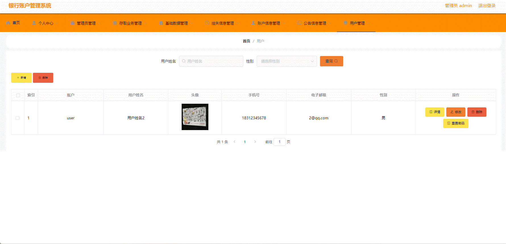

#  bank-accounts🎂

基于SpringBoot+Vue的银行账目系统

## 介绍🌞

> 系统的功能主要包括开户，存取业务，挂失，发布公告信息等功能。此外，系统还考虑了数据的一致性、完整性和安全性，确保在数据库的建立和维护过程中，数据的准确性和可靠性得到有效保障。本系统操作界面简单，对用户操作要求较低，对于提升银行运营效率、用户满意度以及支持业务创新等方面具有重要意义。

## 软件架构

- 管理员在本系统中拥有较多权限，主要包括登录、查看个人信息、修改个人信息、管理员管理（新增管理员账户、删除管理员账户、查询管理员账户）、存取业务管理（存取业务操作、删除存取信息、查询存取信息）、基础数据管理（挂失类型管理、账户类型管理、公告类型管理）、挂失信息管理（新增挂失信息、删除挂失信息、查询挂失信息）、账户信息管理（开户、删除账户、查询账户信息）、公告信息管理（新增公告信息、删除公告信息、查询公告信息）。
- 用户在本系统中拥有的功能主要包括登录、查看个人信息、修改个人信息、存取业务管理（存取业务操作、查询存取信息）、挂失信息管理（挂失业务操作、查询挂失信息）、账户信息管理（开户、查询账户信息）、公告信息管理（查询公告信息）。

## 项目演示🌞




## 安装教程🌞

```
1. 运行环境准备mysql8 + java8 + node14.16.1 

2. 配置maven路径，加载依赖

3. 运行sql文件，确保application.yml或config.properties的数据库名称和账号密码是数据库所在主机的账号密码
```


## 使用说明🌞

```
1. 登入

      管理员账号：admin 密码：123456

	  客户账号：user 密码：123456
  
2. 运行流程

SpringBoot+Vue项目的部署详情可以查看这篇CSDN博客：http://t.csdnimg.cn/kpuxS

前后端不分离项目的部署流程可以查看这篇CSDN博客：http://t.csdnimg.cn/CslA5
```


## CSDN项目合集🌞

点击前往：http://t.csdnimg.cn/Q4u84


## 联系我🌞

**有偿获取完整源码或调试代码**

🐧：1902317191

微信：


